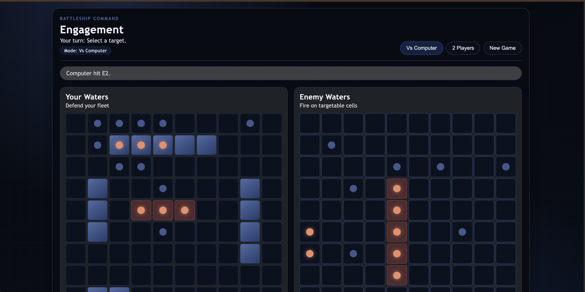

# Battleship



Web game for [The Odin Project](https://www.theodinproject.com/).

[Live Website](https://chiefwoods.github.io/battleship)

[Source Repository](https://github.com/ChiefWoods/battleship)

## Features

- Classic head-to-head board game
- Play against a computer or player

## Built With

### Languages

- [](https://html5.org/)
- [](https://www.w3.org/Style/CSS/Overview.en.html)
- [](https://js.org/index.html)

### Test Runner

- [](https://vitest.dev)

## Getting Started

### Prerequisites

Update your Bun toolkit to the latest version.

```bash
bun upgrade
```

### Setup

1. Clone the repository

```bash
git clone https://github.com/ChiefWoods/battleship.git
```

2. Install all dependencies

```bash
bun install
```

3. Start development server

```bash
bun run dev
```

4. Build project

```bash
bun run build
```

5. Preview build

```bash
bun run preview
```

6. Test project

```bash
bun run test
```

## Issues

View the [open issues](https://github.com/ChiefWoods/battleship/issues) for a full list of proposed features and known bugs.

## Acknowledgements

### Resources

- [Shields.io](https://shields.io/)
- [Lucide](https://lucide.dev/)

### Hosting

- [GitHub Pages](https://pages.github.com/)

## Contact

[chii.yuen@hotmail.com](mailto:chii.yuen@hotmail.com)
